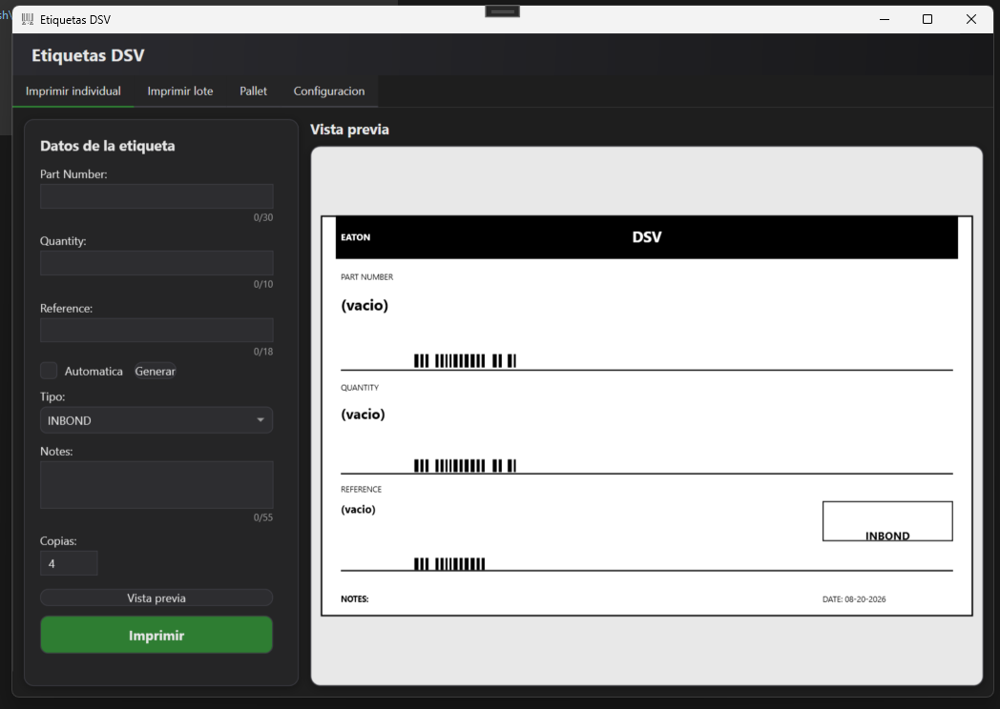
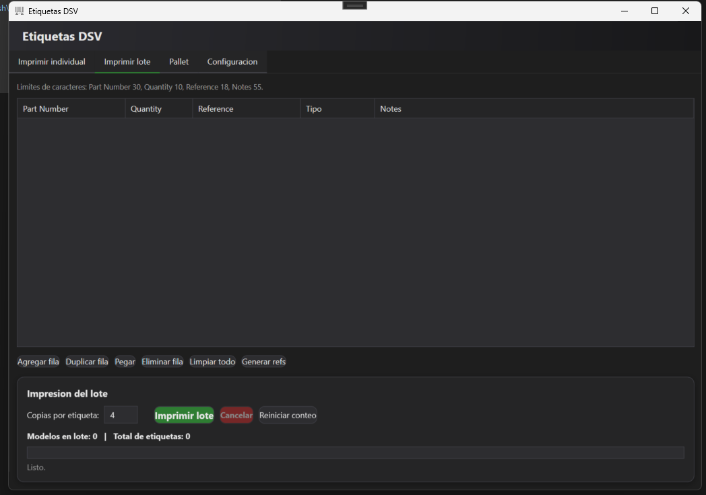

# Etiquetas DSV - version .NET / WPF

Aplicacion de escritorio para generar e imprimir etiquetas Zebra (ZPL) para
envios IN-BOND / DOMESTIC. Reescritura de la app original en Python. Misma
logica de generacion de ZPL, misma tecnica de impresion RAW via
winspool.drv, interfaz nativa de Windows en modo oscuro con formularios
propios (sin dialogos nativos de Windows).

## Requisitos para compilar (una sola vez, en tu PC con Windows)

1. Instala el **SDK de .NET 8** (gratis):
   https://dotnet.microsoft.com/download/dotnet/8.0
   Durante la instalacion no se requieren permisos especiales de
   administrador si usas el instalador normal para tu usuario.

2. Verifica que quedo instalado, abre una terminal (PowerShell) y corre:

       dotnet --version

   Debe mostrar algo como "8.0.x" (o superior).

## Como compilarlo y probarlo mientras editas

Parado en la carpeta del proyecto (donde esta EtiquetasDSV.csproj):

    dotnet build

Si compila sin errores, para correrlo directo sin generar el .exe final:

    dotnet run

## Como generar el .exe final (un solo archivo, sin instalar nada)

    dotnet publish -c Release -r win-x64 --self-contained true -p:PublishSingleFile=true

El archivo queda en:

    bin\Release\net8.0-windows\win-x64\publish\EtiquetasDSV.exe

Ese unico .exe ya incluye el runtime de .NET adentro: se copia a
cualquier PC con Windows y corre con doble clic, sin instalar nada.
Pesa mas que la version framework-dependent (unos 60-150 MB) porque
carga el runtime completo, pero es la opcion mas segura para una PC
sin permisos de instalacion.

## Que hace la app

Cuatro pestanas en la ventana principal (`MainWindow.xaml`):

1. **Imprimir individual** - captura los datos de una etiqueta (Part
   Number, Quantity, Reference, Tipo, Notes, copias, impresora), muestra
   una vista previa aproximada y la envia a imprimir.
2. **Imprimir lote** - una tabla editable donde se pueden agregar filas a
   mano o pegar directamente filas copiadas de Excel (Ctrl+V / boton
   "Pegar del portapapeles", columnas en orden Part Number, Quantity,
   Reference, Tipo, Notes separadas por tab). Imprime todas las filas en
   segundo plano con barra de progreso y boton de cancelar.
3. **Pallet** - etiqueta de pallet independiente, con solo dos campos
   (Reference y Pallet) mas copias e impresora. Usa una plantilla ZPL
   propia (`ZplBuilder.ConstruirPallet()`, ver "Ajustar el diseno de la
   etiqueta" abajo) que no va rotada 90 grados como la etiqueta principal,
   por lo que no tiene panel de vista previa.
4. **Configuracion** - datos fijos que se repiten en toda etiqueta
   (titulo del header, dos lineas de "From", formato de fecha .NET). Se
   guardan en disco y se recargan al abrir la app.

## Estructura del proyecto

    EtiquetasDSV.csproj      - configuracion del proyecto (icono, target framework, publish)
    App.xaml / .cs           - punto de entrada; App.xaml define TODO el tema oscuro global
                                (colores, estilos de Button/TextBox/ComboBox/TabControl/DataGrid,
                                sombras y esquinas redondeadas) como recursos compartidos
    MainWindow.xaml           - diseno de las 4 pestanas (Individual, Lote, Pallet, Config) + header
    MainWindow.xaml.cs        - logica de la ventana: eventos, validaciones, impresion, lote, pallet
    ZplBuilder.cs              - construye la cadena ZPL de la etiqueta (fuente de verdad de
                                 las coordenadas reales que se imprimen); tambien construye la
                                 etiqueta de Pallet (ConstruirPallet())
    VistaPrevia.cs              - dibuja en el Canvas una aproximacion visual de la etiqueta,
                                 usando las MISMAS coordenadas que ZplBuilder.cs (ver abajo)
    PrinterService.cs            - enumera impresoras y envia ZPL crudo (P/Invoke a winspool.drv)
    CustomMessageBox.xaml / .cs  - dialogo modal con tema oscuro propio; reemplaza
                                 System.Windows.MessageBox (que siempre sale en blanco/claro)
    FilaLote.cs                   - modelo de una fila de la tabla de lote (INotifyPropertyChanged)
    Config.cs                      - configuracion persistente (JSON en el perfil de Windows)

## Tema visual (App.xaml)

Toda la apariencia esta centralizada como recursos de `Application` en
`App.xaml`, para que cualquier ventana o control nuevo la herede
automaticamente sin repetir estilos:

- **Paleta de color** (`BgWindow`, `BgPanel`, `BgControl`, `BorderCol`,
  `TextMain`, `TextMuted`, `AccentGreen`, `AccentRed`, `AccentBlue`,
  `AccentAmber`, ...) y un degradado sutil `HeaderGradient` para el header
  de la ventana.
- **`PanelStyle`** - estilo reutilizable de `Border` con esquinas
  redondeadas, fondo de panel y sombra ligera (`PanelShadow`, un
  `DropShadowEffect`). Se usa en los paneles de captura, el bloque de
  impresion de lote y el panel de configuracion.
- **Controles retemplados por completo** (no solo `Background`/
  `Foreground`, porque WPF no repinta el chrome nativo con eso): `Button`
  (`BotonNormal`/`BotonImprimir`/`BotonCancelar`, esquinas redondeadas),
  `ComboBox` (incluyendo el `Popup` desplegable y `ComboBoxItem`, que por
  defecto WPF dibuja en blanco), `TabControl` (la franja completa del
  header de pestanas, para que no quede una franja clara donde no hay
  pestanas) y `TabItem`.
- **`CustomMessageBox`** sigue el mismo tema (panel oscuro, botones con
  los mismos estilos, iconos de color segun severidad) en vez del
  `MessageBox` nativo de Windows, que ignora el tema oscuro de la app.

Si agregas un control nuevo y se ve con colores del sistema (blanco), es
casi siempre porque WPF no aplica `Background`/`Foreground` al chrome
interno del `ControlTemplate` por defecto: hay que reemplazar la
plantilla completa (como se hizo con `ComboBox` y `TabControl`), no basta
con poner un `Setter`.

## Sistema de coordenadas de la etiqueta (ZplBuilder + VistaPrevia)

La etiqueta fisica mide 4 x 6.5 in a 300 dpi: `^PW1200` (ancho de
impresion) x `^LL1950` (largo de etiqueta), y el contenido se dibuja
rotado 90 grados (`^A0R` para texto, `^BCR` para codigos de barra) porque
la etiqueta se lee "de lado" respecto a como se alimenta en la impresora.

`ZplBuilder.Construir()` es la **unica fuente de verdad** de las
coordenadas reales que se imprimen (identicas a la plantilla validada en
labelary.com/viewer.html y usada en la macro de Excel). `VistaPrevia.cs`
no inventa sus propias posiciones: toma esos mismos valores `^FOx,y` /
`^GBancho,alto` y les aplica la transformacion de rotacion

    vistaX = zplY * escala
    vistaY = (1200 - zplX) * escala

(y el equivalente para rectangulos, intercambiando ancho/alto) para
mostrar la etiqueta tal como se lee ya impresa. Esto es importante: si
cambias una coordenada en `ZplBuilder.cs` (mover un campo, agregar un
elemento), la vista previa **no se actualiza sola** — hay que replicar el
mismo cambio de coordenada en `VistaPrevia.cs` usando esa misma formula
para que preview y ZPL real sigan coincidiendo.

No es un renderizado pixel-perfecto (los codigos de barra se dibujan como
franjas negras de relleno, no como un Code128 real). Para verificar el
diseno exacto antes de imprimir en produccion, sigue usando
labelary.com/viewer.html con el ZPL generado.

La etiqueta de **Pallet** (`ZplBuilder.ConstruirPallet()`) es una plantilla
distinta y no sigue esta logica: no va rotada (usa `^A0N` / `^BCN` en vez
de `^A0R` / `^BCR`), replica tal cual las coordenadas de `zpl_pallet.txt`,
y por eso no tiene vista previa en pantalla.

## Impresion (PrinterService.cs)

Envia la cadena ZPL como datos RAW directamente a la cola de impresion de
Windows via P/Invoke a `winspool.drv` (`OpenPrinter` / `StartDocPrinter` /
`WritePrinter` / ...), sin pasar por el subsistema de graficos de
Windows. No depende de `System.Drawing.Printing` ni de referencias
extra. `ListarImpresoras()` usa `EnumPrinters` para poblar los combos de
impresora en ambas pestanas.

## Configuracion persistente (Config.cs)

Los datos fijos (titulo, direccion "From", formato de fecha, ultima
impresora y copias usadas) se guardan como JSON en:

    %USERPROFILE%\etiquetas_dsv_config.json

Se cargan al iniciar la app (`Config.Cargar()`) y se guardan al presionar
"Guardar configuracion" (`Config.Guardar()`). Si el archivo no existe o
esta corrupto, se usan valores por defecto sin tronar la app.

## Ajustar el diseno de la etiqueta

Las coordenadas del ZPL estan en `ZplBuilder.cs`, metodo `Construir()`.
Son identicas a las de la version en Excel/VBA, asi que cualquier ajuste
que ya hayas hecho ahi (mover un codigo de barras, cambiar un texto) se
puede replicar cambiando el mismo numero en este archivo. Despues,
replica el cambio en `VistaPrevia.cs` (ver "Sistema de coordenadas"
arriba) para que la vista previa siga siendo fiel a lo que se imprime.

La etiqueta de Pallet tiene sus propias coordenadas en
`ZplBuilder.cs`, metodo `ConstruirPallet()`, tomadas tal cual de
`zpl_pallet.txt`. Como no tiene vista previa, un ajuste ahi no requiere
tocar `VistaPrevia.cs`.
